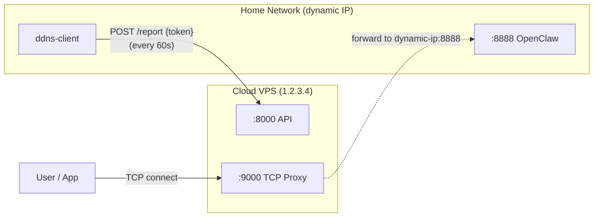
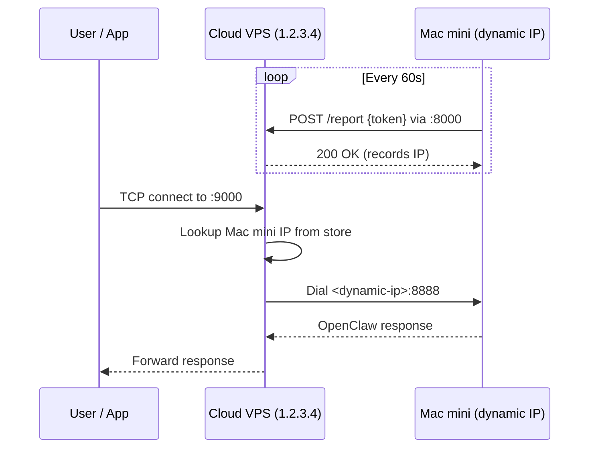

# DDNS + Traffic Proxy Service

A lightweight Go service that lets a machine with a dynamic IP register itself with a server on a static IP. The server then proxies TCP traffic to the registered dynamic IP.

## Deployment Example

Below is a real-world scenario: a cloud server with a static IP proxies traffic to a Mac mini at home running [OpenClaw](https://github.com/nicognaW/OpenClaw), whose IP changes dynamically.



**Deployment steps:**

1. On the cloud VPS (`1.2.3.4`), run `ddns-server` with config:

```yaml
server:
  api_port: 8000
  proxy_port: 9000
  target_port: 8888     # OpenClaw port on the Mac mini
  token: "your-secret"
```

2. On the Mac mini, run `ddns-client` with config:

```yaml
client:
  server_url: "http://1.2.3.4:8000"
  token: "your-secret"
  interval: 60
```

3. The client reports the Mac mini's current IP to the server every 60 seconds.

4. Any request to `1.2.3.4:9000` is transparently forwarded to `<mac-mini-ip>:8888`.

**Communication flow:**



## Build

```bash
go build -o ddns-server ./cmd/server
go build -o ddns-client ./cmd/client
go build -o ddns-mockservice ./cmd/mockservice
```

## Configuration

Copy the example config and edit it:

```bash
cp config.example.yaml config.yaml
```

```yaml
server:
  api_port: 8000        # A2 - HTTP API port
  proxy_port: 9000      # A1 - TCP proxy port
  target_port: 8888     # B1 - Target port on the dynamic IP machine
  token: "my-secret"    # Shared authentication token

client:
  server_url: "http://your-server:8000"
  token: "my-secret"
  interval: 60          # Report interval in seconds
```

## Usage

### Server

Run on the machine with a static IP:

```bash
./ddns-server -config config.yaml
```

The server exposes two ports:

- **Port A2** (default 8000) - HTTP API for IP registration and querying
- **Port A1** (default 9000) - TCP proxy that forwards traffic to the registered dynamic IP

### Client

Run on the machine with a dynamic IP:

```bash
./ddns-client -config config.yaml
```

The client reports its IP to the server immediately on startup, then every `interval` seconds. The server auto-detects the client's IP from the HTTP connection if not provided explicitly.

### Mock Service (for testing)

Run on the client machine to verify that the proxy is forwarding traffic correctly. It listens on a TCP port (default 8888, matching `server.target_port`) and prints every incoming connection and its data to stdout.

```bash
./ddns-mockservice -port 8888
```

Example output:

```
[#1] 14:03:21  New connection from 10.0.0.1:54321
[#1] 14:03:21  Received 11 bytes:
hello world
[#1] 14:03:22  Connection closed
```

To quickly test the full pipeline locally:

```bash
# Terminal 1: start the mock service on the target port
./ddns-mockservice -port 8888

# Terminal 2: start the server
./ddns-server -config config.yaml

# Terminal 3: register 127.0.0.1 as the dynamic IP
curl -X POST http://localhost:8000/report \
  -H 'Content-Type: application/json' \
  -d '{"token":"my-secret","ip":"127.0.0.1"}'

# Terminal 4: send data through the proxy
echo "hello world" | nc localhost 9000
```

## API

### POST /report

Register the client's dynamic IP.

```bash
curl -X POST http://server:8000/report \
  -H 'Content-Type: application/json' \
  -d '{"token": "my-secret"}'
```

The server extracts the client IP from the request. To specify an IP explicitly:

```bash
curl -X POST http://server:8000/report \
  -H 'Content-Type: application/json' \
  -d '{"token": "my-secret", "ip": "1.2.3.4"}'
```

### GET /ip

Query the currently registered dynamic IP.

```bash
curl http://server:8000/ip
```

Response:

```json
{"ip": "1.2.3.4", "updated_at": "2026-02-27T12:00:00Z"}
```
